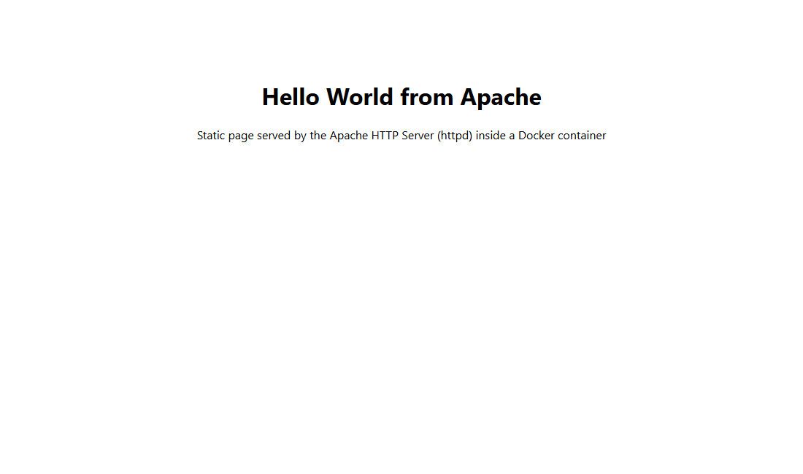
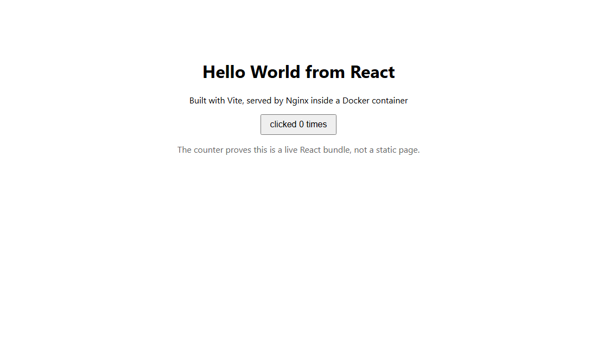

# Docker Fundamentals: six Hello World apps

Six web apps, one folder each, each with its own Dockerfile. All six built, ran, and returned HTTP 200.

| Folder | Stack | Port | Image size |
|---|---|---|---|
| `nodejs-app` | Express | 8081 | 209 MB |
| `python-app` | Flask | 8082 | 208 MB |
| `java-app` | JDK HttpServer | 8083 | 286 MB |
| `apache-app` | httpd | 8084 | 96 MB |
| `react-app` | Vite + Nginx | 8085 | 74 MB |
| `nginx-app` | Nginx | 8086 | 74 MB |

Build and run any of them the same way:

```bash
cd nodejs-app
docker build -t hello-nodejs:1.0 .
docker run -d --name hello-nodejs -p 8081:3000 hello-nodejs:1.0
```

## The apps running







## Proof from the terminal

```console
  nodejs-app  ->  http://localhost:8081
<h1>Hello World from Node.js</h1>
HTTP status: 200
  python-app  ->  http://localhost:8082
<h1>Hello World from Python</h1>
HTTP status: 200
  java-app  ->  http://localhost:8083
<h1>Hello World from Java</h1>
HTTP status: 200
  apache-app  ->  http://localhost:8084
<h1>Hello World from Apache</h1>
HTTP status: 200
  react-app  ->  http://localhost:8085
HTTP status: 200
  nginx-app  ->  http://localhost:8086
<h1>Hello World from Nginx</h1>
HTTP status: 200
```

## Notes on each Dockerfile

**Node.js** copies `package.json` and runs `npm install` *before* copying `server.js`. That ordering matters: Docker caches each layer, so if I only change my app code, the install layer is reused and the rebuild is fast. Copying everything at once would reinstall dependencies on every edit.

**Python** does the same trick with `requirements.txt`, and uses `--no-cache-dir` so pip doesn't leave a cache in the image.

**Java** is a two-stage build. It compiles with the full JDK, then copies only the `.class` files into a JRE image. The compiler doesn't need to ship to production.

**Apache and Nginx** are just a base image plus one `COPY` of `index.html`. No `CMD` needed, because the base images already start the server in the foreground. A container stays alive only as long as its main process runs, so that foreground part is essential.

**React** is the most interesting one. Stage 1 uses Node to run `npm run build`, which turns JSX into plain static files. Stage 2 throws Node away entirely and serves the built `dist/` folder with Nginx. The final image has no Node, no `node_modules`, and no source code, which is why it's 74 MB instead of the ~209 MB the Node image weighs.

The React screenshot has a working click counter in it, which was my way of confirming the JavaScript bundle really was being served and executed, rather than just a static page that happened to look right.

<details>
<summary>Full curl output for all six apps</summary>

```console
==============================================
  nodejs-app  ->  http://localhost:8081
==============================================
$ curl -s http://localhost:8081
<!doctype html>
<html>
  <head><title>Node.js Hello World</title></head>
  <body style="font-family: system-ui, sans-serif; text-align: center; padding-top: 80px;">
    <h1>Hello World from Node.js</h1>
    <p>Served by Express inside a Docker container</p>
    <p>Node v20.20.2 &middot; host 911e2724d30b</p>
  </body>
</html>
HTTP status: 200

==============================================
  python-app  ->  http://localhost:8082
==============================================
$ curl -s http://localhost:8082
<!doctype html>
<html>
  <head><title>Python Hello World</title></head>
  <body style="font-family: system-ui, sans-serif; text-align: center; padding-top: 80px;">
    <h1>Hello World from Python</h1>
    <p>Served by Flask inside a Docker container</p>
    <p>Python 3.12.14 &middot; host 2c68177e7f71</p>
  </body>
</html>
HTTP status: 200

==============================================
  java-app  ->  http://localhost:8083
==============================================
$ curl -s http://localhost:8083
<!doctype html>
<html>
  <head><title>Java Hello World</title></head>
  <body style="font-family: system-ui, sans-serif; text-align: center; padding-top: 80px;">
    <h1>Hello World from Java</h1>
    <p>Served by the built-in JDK HttpServer inside a Docker container</p>
    <p>Java 21.0.12 &middot; host 95b01db6c231</p>
  </body>
</html>

HTTP status: 200

==============================================
  apache-app  ->  http://localhost:8084
==============================================
$ curl -s http://localhost:8084
<!doctype html>
<html>
  <head><title>Apache Hello World</title></head>
  <body style="font-family: system-ui, sans-serif; text-align: center; padding-top: 80px;">
    <h1>Hello World from Apache</h1>
    <p>Static page served by the Apache HTTP Server (httpd) inside a Docker container</p>
  </body>
</html>

HTTP status: 200

==============================================
  react-app  ->  http://localhost:8085
==============================================
$ curl -s http://localhost:8085
<!doctype html>
<html lang="en">
  <head>
    <meta charset="UTF-8" />
    <meta name="viewport" content="width=device-width, initial-scale=1.0" />
    <title>React Hello World</title>
    <script type="module" crossorigin src="/assets/index-Bw0aSBPs.js"></script>
  </head>
  <body>
    <div id="root"></div>
  </body>
</html>

HTTP status: 200

==============================================
  nginx-app  ->  http://localhost:8086
==============================================
$ curl -s http://localhost:8086
<!doctype html>
<html>
  <head><title>Nginx Hello World</title></head>
  <body style="font-family: system-ui, sans-serif; text-align: center; padding-top: 80px;">
    <h1>Hello World from Nginx</h1>
    <p>Static page served by Nginx inside a Docker container</p>
  </body>
</html>

HTTP status: 200
```

</details>
