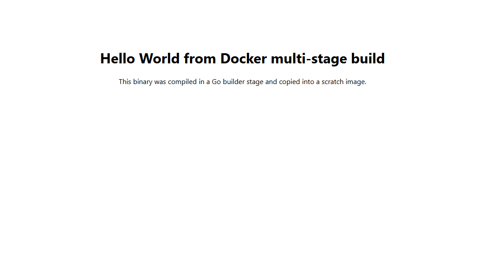
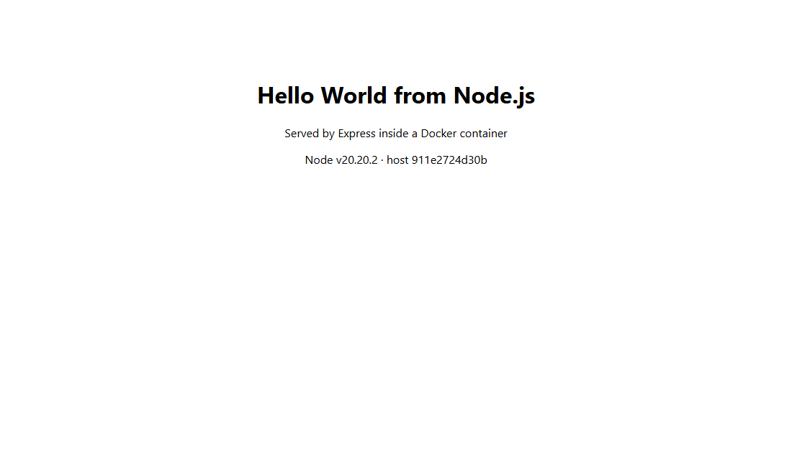
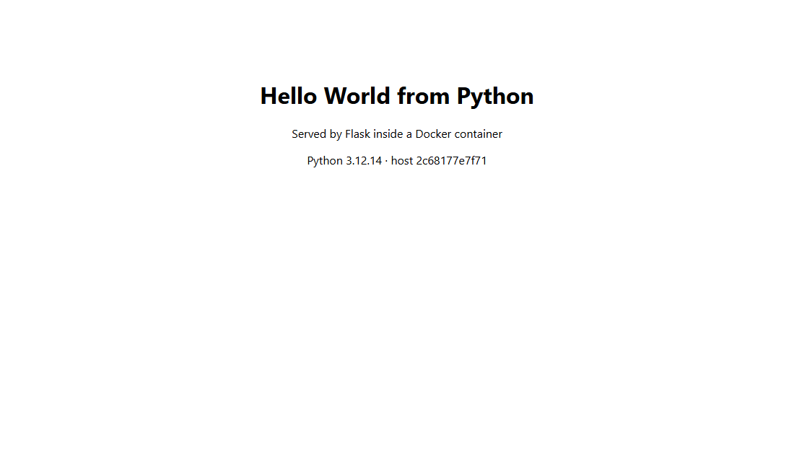
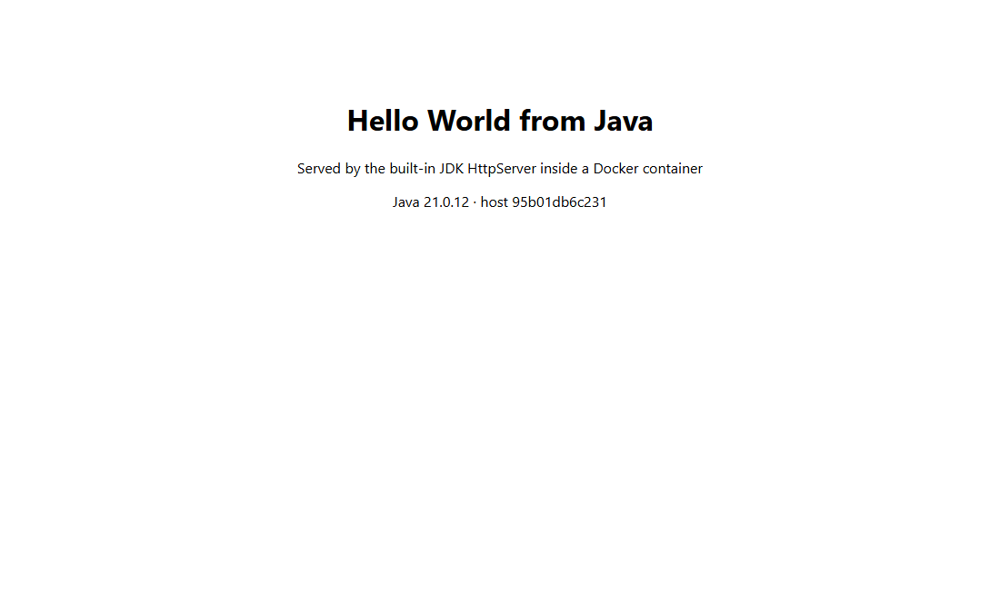

# Dockerfiles and Images: multi-stage build

**Name:** Lavya
**Enrollment Number:** 24BCS10124

## Task 1: Multi-stage build on port 8080

A small Go web server that prints `Hello World from Docker multi-stage build`, built with a two-stage Dockerfile.

The idea: stage 1 has the whole Go toolchain and compiles the binary. Stage 2 starts from `scratch`, a completely empty image, and copies **only the compiled binary** across. The compiler, the source and the build cache never make it into what I ship.

```dockerfile
# Stage 1: build
FROM golang:1.23-alpine AS builder
WORKDIR /src
COPY go.mod ./
RUN go mod download
COPY main.go ./
RUN CGO_ENABLED=0 GOOS=linux go build -ldflags="-s -w" -o /app/server main.go

# Stage 2: runtime, empty base image
FROM scratch
COPY --from=builder /app/server /server
EXPOSE 8080
ENTRYPOINT ["/server"]
```

`CGO_ENABLED=0` matters. It produces a fully static binary, which is what lets it run on `scratch` at all, since there's no libc in there for it to link against.

```bash
docker build -t multistage-hello:1.0 .
docker run -d --name multistage-hello -p 8080:8080 multistage-hello:1.0
```

### The size difference

I built the same app both ways to compare:

```console
REPOSITORY          TAG             SIZE
singlestage-hello   1.0             477MB
multistage-hello    1.0             7.3MB
```

**477 MB down to 7.3 MB.** About 65 times smaller for the exact same program. Smaller images push and pull faster, and there's far less in them to go wrong: no shell, no package manager, nothing for an attacker to use if they get in.

I confirmed there's genuinely no shell in there:

```console
$ docker run --rm --entrypoint /bin/sh multistage-hello:1.0 -c 'ls'
docker: Error response from daemon: failed to create task for container: failed to create shim task: OCI runtime create failed: runc create failed: unable to start container process: error during container init: exec: "/bin/sh": stat /bin/sh: no such file or directory
```

### It running on port 8080

```console
$ docker ps
NAMES              IMAGE                  STATUS         PORTS
multistage-hello   multistage-hello:1.0   Up 3 seconds   0.0.0.0:8080->8080/tcp, [::]:8080->8080/tcp

$ curl -s http://localhost:8080/plain
Hello World from Docker multi-stage build
```



<details>
<summary>Full build and verification output</summary>

```console
########## 1. Build the image from the MULTI-STAGE Dockerfile ##########
DEPRECATED: The legacy builder is deprecated and will be removed in a future release.
+                 ~~~~~~~~~~~~~~~~~~~~~~~~~~~~~~~~~~~~~~~~~~~~~~~~~~~~~~~~~
 
            Install the buildx component to build images with BuildKit:
            https://docs.docker.com/go/buildx/

Sending build context to Docker daemon  6.656kB

Step 1/10 : FROM golang:1.23-alpine AS builder
1.23-alpine: Pulling from library/golang
Digest: sha256:383395b794dffa5b53012a212365d40c8e37109a626ca30d6151c8348d380b5f
Status: Downloaded newer image for golang:1.23-alpine
Step 2/10 : WORKDIR /src
Step 3/10 : COPY go.mod ./
Step 4/10 : RUN go mod download
go: no module dependencies to download
 ---> Removed intermediate container 35be420eb5c3
Step 5/10 : COPY main.go ./
Step 6/10 : RUN CGO_ENABLED=0 GOOS=linux go build -ldflags="-s -w" -o /app/server main.go
Step 7/10 : FROM scratch
Step 8/10 : COPY --from=builder /app/server /server
Step 9/10 : EXPOSE 8080
Step 10/10 : ENTRYPOINT ["/server"]
Successfully built 53f7c49a38b6
Successfully tagged multistage-hello:1.0

########## 2. Build the SINGLE-STAGE equivalent for comparison ##########
DEPRECATED: The legacy builder is deprecated and will be removed in a future release.
            Install the buildx component to build images with BuildKit:
            https://docs.docker.com/go/buildx/

Sending build context to Docker daemon  6.656kB

Step 1/6 : FROM golang:1.23-alpine
Step 2/6 : WORKDIR /src
Step 3/6 : COPY go.mod main.go ./
Step 4/6 : RUN CGO_ENABLED=0 go build -o /app/server main.go
Step 5/6 : EXPOSE 8080
Step 6/6 : ENTRYPOINT ["/app/server"]
Successfully built b22297c37a3b
Successfully tagged singlestage-hello:1.0

########## 3. Compare the two image sizes ##########
REPOSITORY          TAG             SIZE
singlestage-hello   1.0             477MB
multistage-hello    1.0             7.3MB

########## 4. Run a container from the multi-stage image on port 8080 ##########

########## 5. Verify with docker ps (container running on port 8080) ##########
NAMES              IMAGE                  STATUS         PORTS
multistage-hello   multistage-hello:1.0   Up 3 seconds   0.0.0.0:8080->8080/tcp, [::]:8080->8080/tcp

########## 6. Access the application inside the container ##########
$ curl -s http://localhost:8080/plain
Hello World from Docker multi-stage build

$ curl -s http://localhost:8080
<!doctype html>
<html>
  <head><title>Docker Multi-Stage Build</title></head>
  <body style="font-family: system-ui, sans-serif; text-align: center; padding-top: 80px;">
    <h1>Hello World from Docker multi-stage build</h1>
    <p>This binary was compiled in a Go builder stage and copied into a scratch image.</p>
  </body>
</html>

########## 7. Prove the final image really is empty apart from the binary ##########
$ docker history multistage-hello:1.0
IMAGE          CREATED          CREATED BY                                      SIZE      COMMENT
53f7c49a38b6   15 seconds ago   /bin/sh -c #(nop)  ENTRYPOINT ["/server"]       0B        
b3f0ce16cc53   15 seconds ago   /bin/sh -c #(nop)  EXPOSE 8080                  0B        
f99dddc64c24   15 seconds ago   /bin/sh -c #(nop) COPY file:b8aa357b02f6cc3c…   5.08MB    

$ docker run --rm --entrypoint /bin/sh multistage-hello:1.0 -c 'ls'   # there is NO shell in scratch
docker: Error response from daemon: failed to create task for container: failed to create shim task: OCI runtime create failed: runc create failed: unable to start container process: error during container init: exec: "/bin/sh": stat /bin/sh: no such file or directory

Run 'docker run --help' for more information
```

</details>

---

## Task 2: Documentation

Covered by this file: name, enrollment number, the app running on 8080, and the `docker ps` output above showing the container and its port mapping.

---

## Task 3: Deploying three different application types

Built and ran in [`../Docker-Fundamentals`](../Docker-Fundamentals/README.md), all confirmed with HTTP 200.

**Node.js**, port 8081:



**Python**, port 8082:



**Java**, port 8083:



```console
$ docker ps --format "table {{.Names}}\t{{.Image}}\t{{.Status}}\t{{.Ports}}"
NAMES              IMAGE                  STATUS         PORTS
hello-java         hello-java:1.0         Up 3 seconds   0.0.0.0:8083->8080/tcp, [::]:8083->8080/tcp
hello-python       hello-python:1.0       Up 3 seconds   0.0.0.0:8082->5000/tcp, [::]:8082->5000/tcp
hello-nodejs       hello-nodejs:1.0       Up 3 seconds   0.0.0.0:8081->3000/tcp, [::]:8081->3000/tcp
```
